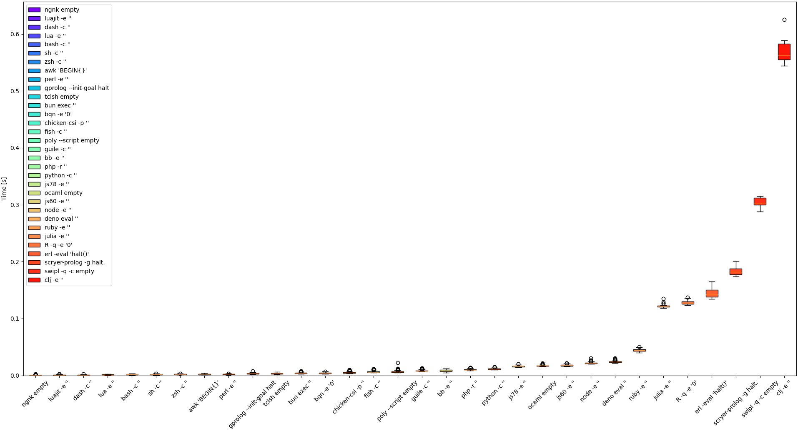
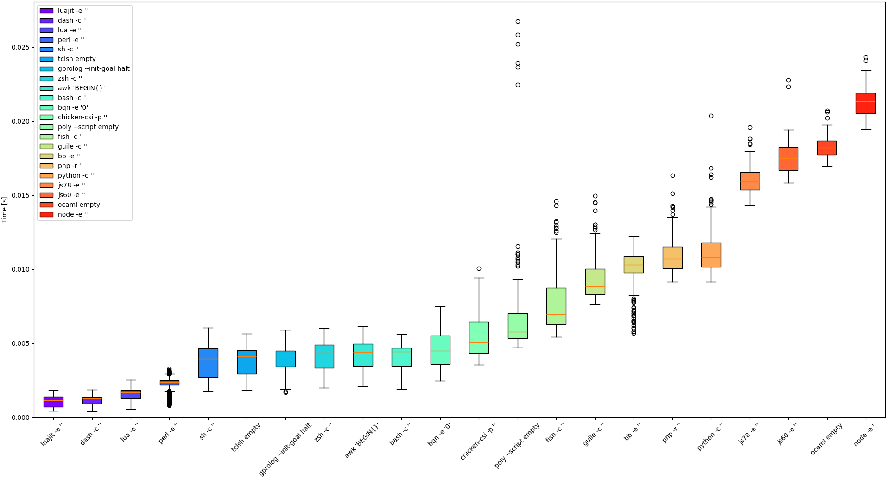

# Measuring startup and shutdown overhead of several code interpreters

I used the hyperfine tool to measure the overhead of startup and shutdown of several code interpreters using hyperfine tool.

You can read a [full blog post](https://dev.to/serpent7776/measuring-startup-and-shutdown-overhead-of-several-code-interpreters-5hbl).

## Updated Results

